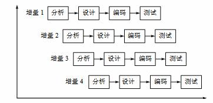

# 软件工程项目记录

## 更新记录

- d1025 软件工程项目准备开始

## 项目要求

**模拟QQ聊天程序**

- 功能要求

  1. 登录功能。
  2. 客户可以通过服务器转发，实现一对一和多对多聊天。
  3. 实现呼叫功能。
  4. 客户端程序应该可以实时显示目前其它用户的状态。
  5. 保存并能察看聊天纪录。
  6. 申请新的用户号码。
  7. 易用、美观的图形界面，实现系统托盘。

- 服务器及客户端的功能：

  - 客户端：

    1. 登陆功能：建立与服务器的连接并登陆，能显示登陆错误信息。
    2. 界面显示：将在线好友显示在好友列表中，并实现系统托盘，加入工具栏便于操作。
    3. 聊天功能：与好友聊天。
    4. 聊天纪录：能保存聊天纪录，并能察看聊天纪录。
    5. 信息提示：闪动托盘图标提示到来信息，并播放不同音乐来提示。
    6. 其他：用户登陆成功，将保存其号码，以便下次登陆时，不必再输入而可以直接选择，显示登陆时间。

  - 服务器端：

    1. 向各个客户端发布系统消息。
    2. 接受来自客户端的各种信息并分别处理。
    3. 登陆信息：检查登陆信息是否正确，并向客户端返回登陆信息，如信息正确。就将在线用户发给该用户，并将该用户的状态发给各在线用户。同时在服务器端显示出来。
    4. 聊天信息：转发给消息指定的用户。
    5. 申请信息：自动分配8位用户号码，并保存该用户，同时将信息返回给客户端。
    6. 用户下线：将此用户下线消息发给各客户端，并改写用户在服务器端的状态。

    ​

    > 组长：刘年
    >
    > 组员：黄成越，杨红，蔡春波

## 项目采用模型

​	本项目采用增量式开发。

​	

## 采用该模型分析

> 开始日期:2016-10-25

> 预定完成时间:2016-10-29

> 结束日期:

> 完成者:杨红

包括优势、符合该需求的特性、基本项目流程图

## 概要描述

> 开始日期:2016-10-25

> 预定完成时间:2016-10-29

> 结束日期:

> 完成者:黄成越

包括整个系统要实现哪些功能

这些功能可以分哪些阶段，模块

# 增量开发记录

## 初始版本设计

> 开始日期:

> 预定完成时间:2016-11-3

> 结束日期:

### 需求分析

> 完成者:刘年

初始版本将完成以下功能：

- 客户端
  - 连接服务器：能够连接服务器，并通过输入输出流通信。
  - 登陆功能：建立与服务器的连接并登陆，能显示登陆错误信息。
  - 好友列表：能够根据服务器发回数据，显示好友列表。
  - 在线好友聊天：能够与在线的好友聊天。
- 服务器端
  - 接受客户端：能够接受客户端，并通过输入输出流通信。
  - 能够处理客户端的登陆请求。
  - 能够给客户端发送好友列表。
  - 能够支持客户端与另一个在线客户端聊天。

### 系统设计

> 完成者:刘年、蔡春波

### 编码

> 完成者:刘年

### 测试

>完成者:全员测试

